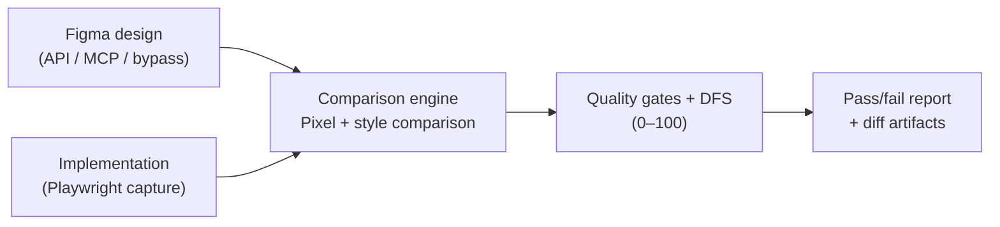

# uiMatch

[](https://github.com/kosaki08/uimatch/actions/workflows/ci.yml)
[](https://codecov.io/gh/kosaki08/uimatch)

> Status: Experimental / 0.x. APIs may change without notice and are not
> production-ready.

uiMatch compares a Figma design with an implemented UI. It combines pixel and
style comparison, quality gates, and selector resolution into a CLI suitable
for local development and CI.

## Quick start

Install the CLI and Playwright, then install Chromium:

```shell
npm install -D @uimatch/cli playwright
npx playwright install chromium
export FIGMA_ACCESS_TOKEN="figd_..."
```

Compare one Figma node with an implementation:

```shell
npx @uimatch/cli compare \
  figma=<fileKey>:<nodeId> \
  story=http://localhost:6006/?path=/story/button \
  selector="#root button" \
  outDir=./uimatch-reports
```

The command exits with `0` when the configured quality gate passes, `1` when
the comparison fails, and `2` for invalid arguments or configuration.

## What it evaluates

- Pixel differences with strict and padded size handling
- Perceptual color differences using ΔE2000
- Style and layout differences from captured browser styles
- Design Fidelity Score and configurable quality gates
- Text normalization and similarity checks
- Stable selector resolution through optional plugins

## Architecture



## Documentation

- [Getting Started](https://kosaki08.github.io/uimatch/docs/getting-started)
- [CLI Reference](https://kosaki08.github.io/uimatch/docs/cli-reference)
- [Concepts](https://kosaki08.github.io/uimatch/docs/concepts)
- [CI Integration](https://kosaki08.github.io/uimatch/docs/ci-integration)
- [Plugin Development](https://kosaki08.github.io/uimatch/docs/plugins)
- [Troubleshooting](https://kosaki08.github.io/uimatch/docs/troubleshooting)
- [API Reference](https://kosaki08.github.io/uimatch/docs/api)

The [documentation site](https://kosaki08.github.io/uimatch/) is the source of
truth for detailed options, configuration, and operational guidance.

## Packages

Public packages:

- `@uimatch/cli` — command-line and programmatic entry point
- `@uimatch/selector-anchors` — AST-based selector plugin
- `@uimatch/selector-spi` — selector plugin contracts
- `@uimatch/shared-logging` — shared logging utilities

Internal workspace packages:

- `@uimatch/core` — capture and comparison engine
- `@uimatch/scoring` — Design Fidelity Score calculation

## Development

Requirements:

- Node.js 20.19+ or 22.12+
- pnpm 9.15+

```shell
pnpm install
pnpm run check
pnpm test
```

See [Local Testing](https://kosaki08.github.io/uimatch/docs/local-testing) for
browser integration and distribution verification.

## Contributing

Contributions are welcome. Read [CONTRIBUTING.md](./CONTRIBUTING.md) before
submitting a change.

## License

MIT
