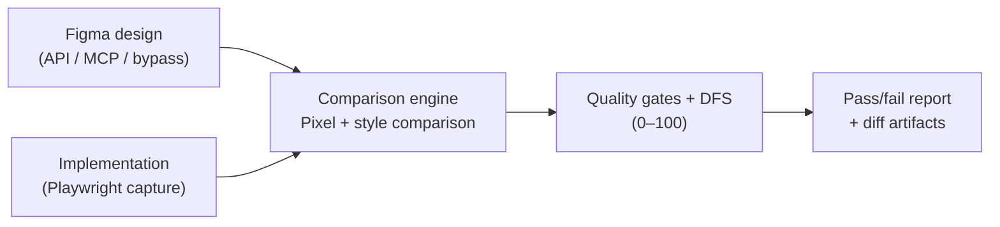

# uiMatch

[](https://github.com/kosaki08/uimatch/actions/workflows/ci.yml)
[](https://codecov.io/gh/kosaki08/uimatch)

Turn visual drift between a Figma design and its implementation into a
repeatable local or CI check.

uiMatch renders the implementation with Playwright, compares it with a Figma
node, and reports differences in pixels, layout, styles, color, and text. Each
run produces a Design Fidelity Score and a configurable pass or fail decision.
When an output directory is set, it also saves reviewable images and a
machine-readable report.

> Status: Experimental / 0.x. APIs may change without notice and are not
> production-ready.

## What you get

- Catch visual regressions against the design rather than relying on review by
  eye alone.
- See computed style and layout differences alongside the pixel diff, making it
  easier to identify what changed.
- Apply the same quality gate locally and in CI, with exit codes that distinguish
  a mismatch from invalid configuration.
- Keep `figma.png`, `impl.png`, `diff.png`, and `report.json` as evidence for
  review and automation.

## Quick start

Install the CLI and Playwright, then install Chromium:

```shell
npm install -D @uimatch/cli playwright
npx playwright install chromium
export FIGMA_ACCESS_TOKEN="figd_..."
```

Compare one Figma node with an implementation:

```shell
npx @uimatch/cli compare \
  figma=<fileKey>:<nodeId> \
  story=http://localhost:6006/?path=/story/button \
  selector="#root button" \
  outDir=./uimatch-reports
```

The command exits with `0` when the configured quality gate passes, `1` when
the comparison fails, and `2` for invalid arguments or configuration.

A successful comparison looks like this:

```text
PASS | DFS: 100 | pixelDiffRatio: 0.00% | colorDeltaEAvg: 0.00 | styleDiffs: 0 (high: 0)

Gate: ✅ PASS
Visual gate: ✅ PASS
Pixel diff ratio: 0.0000
Color delta E (avg): 0.00
CQI: 🟢 100/100
```

Use `suite` to run the same checks across multiple components from one JSON
configuration.

## What it evaluates

- Pixel differences with strict and padded size handling
- Perceptual color differences using ΔE2000
- Style and layout differences from captured browser styles
- Design Fidelity Score and configurable quality gates
- Text normalization and similarity checks
- Stable selector resolution through optional plugins

Typical uses include checking Storybook components against Figma nodes,
enforcing design-system fidelity in pull requests, and producing structured
comparison data for automated workflows.

## Architecture



## Documentation

- [Getting Started](https://kosaki08.github.io/uimatch/docs/getting-started)
- [CLI Reference](https://kosaki08.github.io/uimatch/docs/cli-reference)
- [Concepts](https://kosaki08.github.io/uimatch/docs/concepts)
- [CI Integration](https://kosaki08.github.io/uimatch/docs/ci-integration)
- [Plugin Development](https://kosaki08.github.io/uimatch/docs/plugins)
- [Troubleshooting](https://kosaki08.github.io/uimatch/docs/troubleshooting)
- [API Reference](https://kosaki08.github.io/uimatch/docs/api)

See the [documentation site](https://kosaki08.github.io/uimatch/) for installation
guides, CLI reference, concepts, and troubleshooting.

## Packages

Public packages:

- `@uimatch/cli` — command-line and programmatic entry point
- `@uimatch/selector-anchors` — AST-based selector plugin
- `@uimatch/selector-spi` — selector plugin contracts
- `@uimatch/shared-logging` — shared logging utilities

Internal workspace packages:

- `@uimatch/core` — capture and comparison engine
- `@uimatch/scoring` — Design Fidelity Score calculation

## Development

Requirements:

- Node.js 20.19+ or 22.12+
- pnpm 9.15+

```shell
pnpm install
pnpm run check
pnpm test
```

See [Local Testing](https://kosaki08.github.io/uimatch/docs/local-testing) for
browser integration and distribution verification.

## Contributing

Contributions are welcome. Read [CONTRIBUTING.md](./CONTRIBUTING.md) before
submitting a change.

## License

MIT
