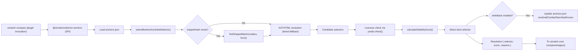
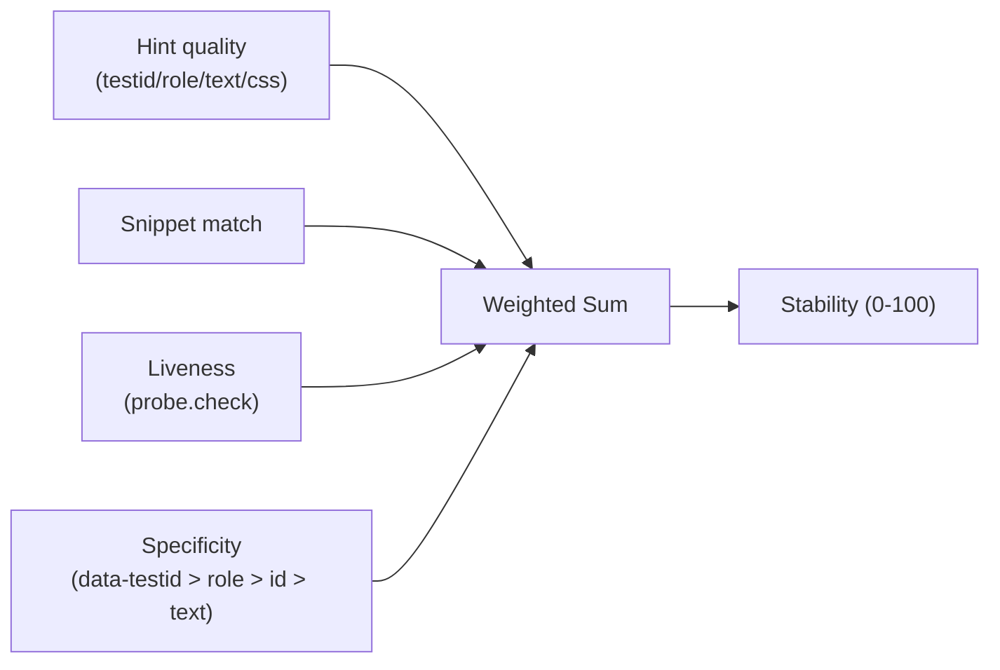
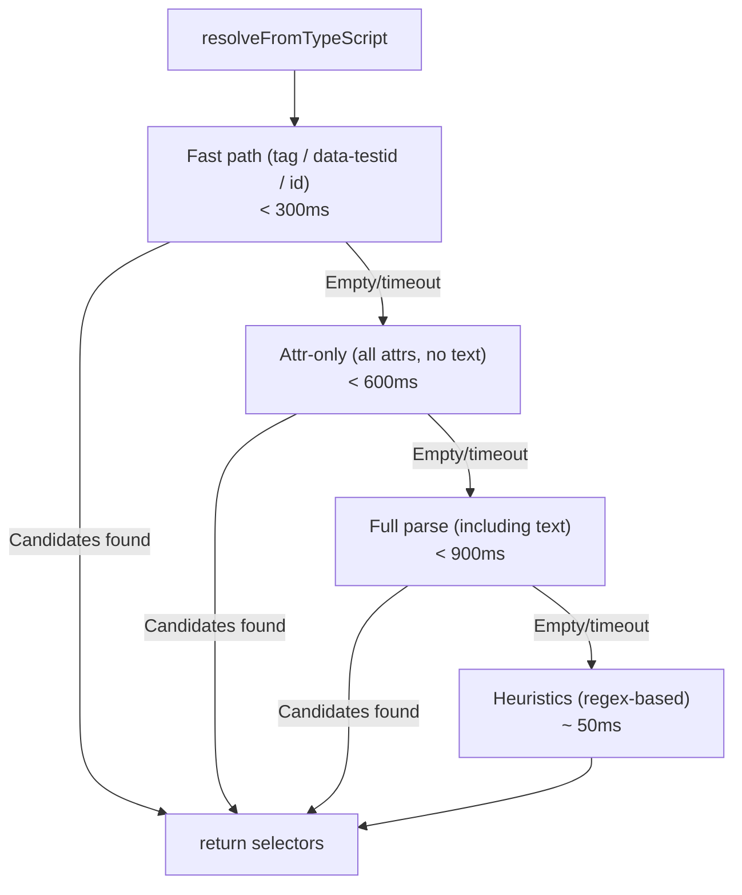

# Selector Resolution

Stable, refactor-proof selectors using AST-based anchors and stability scoring.

## Problem

CSS selectors break easily:

- Line numbers change (refactoring)
- Test IDs not always available
- Class names change (CSS-in-JS)
- Component files move

## Solution: Anchors Plugin

`@uimatch/selector-anchors` provides:

1. **Snippet Hash Matching**: Detect code movement via fuzzy match
2. **AST Resolution**: Extract semantic selectors from TypeScript/JSX
3. **Liveness Checking**: Verify selectors work in browser
4. **Stability Scoring**: Rank candidates by robustness (0-100)

## How It Works



## Stability Scoring



### Components (Default Weights)

| Component     | Weight | Description                                   |
| ------------- | ------ | --------------------------------------------- |
| Hint Quality  | 40%    | testid=1.0, role=0.8, text=0.5, css=0.3       |
| Snippet Match | 20%    | Code location matched (1.0) or not (0.0)      |
| Liveness      | 30%    | Browser validation (1.0=alive, 0.5=unchecked) |
| Specificity   | 10%    | Selector robustness (data-testid > role > id) |

**Result**: Score 0-100. Higher = more stable.

### Example Scores

```typescript
// Excellent (95)
'[data-testid="button-primary"]'; // testid + snippet match + liveness

// Good (75)
'role:button[name="Submit"]'; // role + text + liveness

// Moderate (50)
'#submit-button'; // id + liveness

// Poor (30)
'.btn.primary'; // class only, no semantic hint
```

## AST Resolution Tiered Fallback



**Timeout Hierarchy**: Fast → Attr → Full → Heuristics (configurable via env vars).

## Configuration

### anchors.json

```json
{
  "version": "1.0.0",
  "anchors": [
    {
      "id": "btn-primary",
      "source": {
        "file": "src/Button.tsx",
        "line": 42,
        "col": 10
      },
      "hint": {
        "prefer": ["testid", "role", "text"],
        "testid": "button-primary",
        "role": "button"
      },
      "snippetHash": "a3f2c9d8e1"
    }
  ]
}
```

### Environment Variables

```bash
# AST parsing timeouts
export UIMATCH_AST_FAST_PATH_TIMEOUT_MS=300
export UIMATCH_AST_ATTR_TIMEOUT_MS=600
export UIMATCH_AST_FULL_TIMEOUT_MS=900

# Snippet matching
export UIMATCH_SNIPPET_MAX_RADIUS=400
export UIMATCH_SNIPPET_FUZZY_THRESHOLD=0.6

# Stability scoring weights
export UIMATCH_STABILITY_HINT_WEIGHT=0.4
export UIMATCH_STABILITY_SNIPPET_WEIGHT=0.2
export UIMATCH_STABILITY_LIVENESS_WEIGHT=0.3
export UIMATCH_STABILITY_SPECIFICITY_WEIGHT=0.1
```

## Usage

```bash
# With anchors plugin
npx uimatch compare \
  figma=... story=... selector=... \
  selectors=./anchors.json \
  selectorsPlugin=@uimatch/selector-anchors
```

## Troubleshooting

| Issue                    | Solution                                                     |
| ------------------------ | ------------------------------------------------------------ |
| Low stability score      | Add `hint.testid` or `hint.role` to anchors.json             |
| Snippet hash not matched | Code moved >400 lines, increase `UIMATCH_SNIPPET_MAX_RADIUS` |
| AST timeout              | Increase `UIMATCH_AST_FULL_TIMEOUT_MS`                       |
| Selector not found       | Check `resolvedCss` field, remove to force recheck           |
| False positive liveness  | Element exists but hidden (check visibility in browser)      |

## See Also

- [Examples: Anchors Stabilization](../examples/anchors-stabilization.md) - Setup guide
- [@uimatch/selector-anchors README](../../packages/uimatch-selector-anchors/README.md) - Full plugin docs
