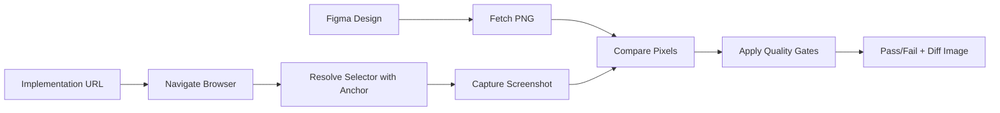

# Core Concepts

Understanding the key concepts behind UI Match.

## Overview

UI Match compares Figma designs with actual implementations by:

1. **Fetching** the design from Figma
2. **Resolving** the implementation element using selectors
3. **Comparing** pixels and reporting differences

Three key concepts make this work: **Anchors**, **Quality Gates**, and **Content Basis**.

## Anchors

Anchors are plugins that resolve CSS selectors to actual DOM elements. They provide flexible ways to target elements in your implementation.

### Why Anchors?

Different frameworks and testing tools use different selector strategies:

- Playwright uses `data-testid`
- Testing Library uses `getByRole` / `getByLabelText`
- Custom component libraries may use proprietary selectors

Anchors let you plug in the selector strategy that matches your project.

### Built-in Anchors

UI Match includes a default CSS selector anchor:

```bash
npx uimatch compare \
  figma=abc123:1-2 \
  story=http://localhost:3000 \
  selector="#my-component"
```

### Custom Anchor Plugins

Create your own anchor to match your testing strategy:

```typescript
import type { SelectorResolverPlugin } from '@uimatch/selector-spi';

export const testIdAnchor: SelectorResolverPlugin = {
  name: 'test-id-anchor',
  version: '1.0.0',
  async resolve(context) {
    const { initialSelector, probe } = context;

    // Transform selector to use data-testid attribute
    const selector = `[data-testid="${initialSelector}"]`;

    // Optionally verify the selector is valid
    const probeResult = await probe.check(selector);
    if (!probeResult.isValid) {
      return {
        selector: initialSelector, // fallback to original
        reasons: ['data-testid selector not found, using original'],
        stabilityScore: 50,
      };
    }

    return {
      selector,
      reasons: ['Resolved via data-testid anchor'],
      stabilityScore: 80,
    };
  },
};
```

Then use it:

```bash
npx uimatch compare \
  figma=abc123:1-2 \
  story=http://localhost:3000 \
  selector=my-button \
  --anchor ./my-test-id-anchor.js
```

See [Plugins](./plugins.md) for complete plugin development guide.

## Quality Gates

Quality Gates define what "matching" means for your comparisons. They enforce consistency standards.

### Quality Gate Profiles

UI Match uses profiles to manage thresholds:

```bash
profile=component/strict  # Pixel-perfect comparison
profile=component/dev     # Relaxed for development
profile=page-vs-component # Accounts for padding
profile=lenient           # Very relaxed for prototyping
```

**How it works:**

- Each profile has predefined thresholds for pixel differences and color variations
- Profiles include `pixelDiffRatio` (acceptable pixel difference ratio) and `deltaE` (color difference threshold)
- Fails if comparison exceeds profile thresholds

### Choosing a Profile

| Profile             | pixelDiffRatio | deltaE | Use Case                                     |
| ------------------- | -------------- | ------ | -------------------------------------------- |
| `component/strict`  | 0.01 (1%)      | 3.0    | **Pixel-perfect** - Design system components |
| `component/dev`     | 0.08 (8%)      | 5.0    | **Development** - Iterative work             |
| `page-vs-component` | 0.12 (12%)     | 5.0    | **Padded** - Letterboxed comparisons         |
| `lenient`           | 0.15 (15%)     | 8.0    | **Prototyping** - Early drafts               |

### Advanced Features

Current implementation supports:

- **Pixel difference ratio** - Percentage of acceptable pixel differences
- **Color difference (deltaE)** - Perceptual color difference threshold
- **Layout issue detection** - Flags high-severity layout problems
- **Automatic re-evaluation** - Smart re-checking with adjusted content basis

## Size Handling

### Size Mode Options

Control size matching behavior:

```bash
size=strict      # Sizes must match exactly (default)
size=pad         # Pad smaller image with letterboxing
size=crop        # Compare common area only
size=scale       # Scale implementation to Figma size
```

**Example:**

```bash
npx uimatch compare \
  figma=abc123:1-2 \
  story=http://localhost:3000 \
  selector="#responsive-card" \
  size=pad \
  contentBasis=intersection
```

This pads the smaller image and uses intersection for content-only comparison (excludes padding noise).

### Content Basis

Control which area to use for calculating pixel difference ratio denominator:

```bash
contentBasis=union          # Union of both content areas (default)
contentBasis=intersection   # Intersection (recommended for pad mode)
contentBasis=figma          # Use Figma's content area only
contentBasis=impl           # Use implementation's content area only
```

**Best Practice:** Use `intersection` with `size=pad` to exclude letterboxing from pixel difference metrics.

## Comparison Workflow

Putting it all together:



1. **Fetch** Figma design as PNG
2. **Navigate** to implementation URL
3. **Resolve** selector using anchor plugin
4. **Capture** screenshot
5. **Compare** pixels
6. **Apply** quality gates (threshold check)
7. **Report** results with diff visualization

## Best Practices

### 1. Start Broad, Refine Later

```bash
# Initial setup - lenient profile
profile=lenient

# After stabilization - tighter profile
profile=component/strict
```

### 2. Use Meaningful Selectors

```bash
# ✅ Good: Semantic, stable selector
selector="[data-testid='checkout-button']"

# ❌ Bad: Fragile, implementation-dependent
selector="div.container > div:nth-child(3) > button"
```

### 3. Group Related Comparisons

Create suite files for logical groupings:

```json
{
  "name": "Authentication Flow",
  "defaults": {
    "profile": "component/dev"
  },
  "items": [
    { "name": "Login Form", "figma": "...", "story": "...", "selector": "#login" },
    { "name": "Signup Form", "figma": "...", "story": "...", "selector": "#signup" },
    { "name": "Password Reset", "figma": "...", "story": "...", "selector": "#reset" }
  ]
}
```

### 4. Version Control Your Baselines

Commit your Figma references and suite files:

```
tests/
  visual-regression/
    suite.json
    baseline-screenshots/
```

## Next Steps

- **[CLI Reference](./cli-reference.md)** - Learn all available options
- **[Troubleshooting](./troubleshooting.md)** - Debug common issues
- **[Plugins](./plugins.md)** - Build custom anchor plugins

## Advanced Topics

For more details, see the API Reference (available in the navigation menu - auto-generated from TypeScript types).
