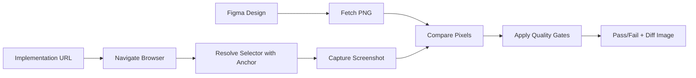

# Core Concepts

Understanding the key concepts behind UI Match.

## Overview

UI Match compares Figma designs with actual implementations by:

1. **Fetching** the design from Figma
2. **Resolving** the implementation element using selectors
3. **Comparing** pixels and reporting differences

Three key concepts make this work: **Anchors**, **Quality Gates**, and **Content Basis**.

## Anchors

Anchors are plugins that resolve CSS selectors to actual DOM elements. They provide flexible ways to target elements in your implementation.

### Why Anchors?

Different frameworks and testing tools use different selector strategies:

- Playwright uses `data-testid`
- Testing Library uses `getByRole` / `getByLabelText`
- Custom component libraries may use proprietary selectors

Anchors let you plug in the selector strategy that matches your project.

### Built-in Anchors

UI Match includes a default CSS selector anchor:

```bash
npx uimatch compare \
  figma=abc123:1-2 \
  story=http://localhost:3000 \
  selector="#my-component"
```

### Custom Anchor Plugins

Create your own anchor to match your testing strategy:

```typescript
import { SelectorPlugin } from '@uimatch/selector-spi';

export const testIdAnchor: SelectorPlugin = {
  name: 'test-id-anchor',
  resolve: async (selector, page) => {
    // Resolve using data-testid
    return page.locator(`[data-testid="${selector}"]`);
  },
};
```

Then use it:

```bash
npx uimatch compare \
  figma=abc123:1-2 \
  story=http://localhost:3000 \
  selector=my-button \
  --anchor ./my-test-id-anchor.js
```

See [Plugins](./plugins.md) for complete plugin development guide.

## Quality Gates

Quality Gates define what "matching" means for your comparisons. They enforce consistency standards.

### Similarity Threshold

The most common quality gate is the similarity threshold:

```bash
--threshold 0.95  # 95% similarity required
```

**How it works:**

- Compares each pixel between Figma and implementation
- Calculates similarity score (0.0 to 1.0)
- Fails if score is below threshold

### Choosing a Threshold

| Threshold   | Use Case                                                             |
| ----------- | -------------------------------------------------------------------- |
| `0.90-0.93` | **Loose** - Allow minor rendering differences (anti-aliasing, fonts) |
| `0.94-0.96` | **Standard** - Catch significant visual issues                       |
| `0.97-0.99` | **Strict** - Pixel-perfect designs (marketing pages)                 |
| `1.00`      | **Exact** - Rarely useful due to browser rendering variations        |

### Advanced Quality Gates

Future versions will support:

- **Color difference thresholds** - Ignore minor color variations
- **Layout shift detection** - Flag position changes
- **Accessibility requirements** - Enforce WCAG compliance

## Content Basis

Content Basis determines how element sizes are handled during comparison.

### Intrinsic vs Extrinsic

**Intrinsic** (natural size):

- Uses the element's natural dimensions
- Content determines size
- Example: Text wrapping, image natural size

**Extrinsic** (specified size):

- Uses explicitly set dimensions
- Container determines size
- Example: Fixed-width containers, flex layouts

### When to Use Each

```bash
# Use intrinsic for content-driven elements
--contentBasis intrinsic
# Example: Blog posts, dynamic text

# Use extrinsic (default) for layout-driven elements
--contentBasis extrinsic
# Example: Navigation bars, cards with fixed dimensions
```

### Size Handling Options

Control size matching behavior:

```bash
--size exact      # Sizes must match exactly
--size figma      # Use Figma's dimensions
--size story      # Use implementation's dimensions
--size contain    # Fit within bounds (default)
```

**Example:**

```bash
npx uimatch compare \
  figma=abc123:1-2 \
  story=http://localhost:3000 \
  selector="#responsive-card" \
  --size contain \
  --contentBasis intrinsic
```

This allows the card to size naturally while ensuring it fits within Figma's defined bounds.

## Comparison Workflow

Putting it all together:



1. **Fetch** Figma design as PNG
2. **Navigate** to implementation URL
3. **Resolve** selector using anchor plugin
4. **Capture** screenshot
5. **Compare** pixels
6. **Apply** quality gates (threshold check)
7. **Report** results with diff visualization

## Best Practices

### 1. Start Broad, Refine Later

```bash
# Initial setup - loose threshold
--threshold 0.90

# After stabilization - tighter threshold
--threshold 0.96
```

### 2. Use Meaningful Selectors

```bash
# ✅ Good: Semantic, stable selector
selector="[data-testid='checkout-button']"

# ❌ Bad: Fragile, implementation-dependent
selector="div.container > div:nth-child(3) > button"
```

### 3. Group Related Comparisons

Create suite files for logical groupings:

```json
{
  "name": "Authentication Flow",
  "comparisons": [
    { "name": "Login Form", "figma": "...", "selector": "#login" },
    { "name": "Signup Form", "figma": "...", "selector": "#signup" },
    { "name": "Password Reset", "figma": "...", "selector": "#reset" }
  ]
}
```

### 4. Version Control Your Baselines

Commit your Figma references and suite files:

```
tests/
  visual-regression/
    suite.json
    baseline-screenshots/
```

## Next Steps

- **[CLI Reference](./cli-reference.md)** - Learn all available options
- **[Troubleshooting](./troubleshooting.md)** - Debug common issues
- **[Plugins](./plugins.md)** - Build custom anchor plugins

## Advanced Topics

For more details, see the API Reference (available in the navigation menu - auto-generated from TypeScript types).
