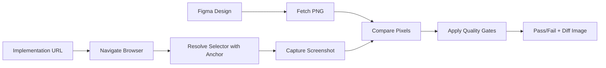

# Core Concepts

Understanding the key concepts behind UI Match.

## Overview

UI Match compares Figma designs with actual implementations by:

1. **Fetching** the design from Figma
2. **Resolving** the implementation element using selectors
3. **Comparing** pixels and reporting differences

Three key concepts make this work: **Anchors**, **Quality Gates**, and **Content Basis**.

## Anchors

Anchors are plugins that resolve CSS selectors to actual DOM elements. They provide flexible ways to target elements in your implementation.

### Why Anchors?

Different frameworks and testing tools use different selector strategies:

- Playwright uses `data-testid`
- Testing Library uses `getByRole` / `getByLabelText`
- Custom component libraries may use proprietary selectors

Anchors let you plug in the selector strategy that matches your project.

### Built-in Anchors

UI Match includes a default CSS selector anchor:

```bash
npx uimatch compare \
  figma=abc123:1-2 \
  story=http://localhost:3000 \
  selector="#my-component"
```

### Custom Anchor Plugins

Create your own anchor to match your testing strategy:

```typescript
import type { SelectorResolverPlugin } from '@uimatch/selector-spi';

export const testIdAnchor: SelectorResolverPlugin = {
  name: 'test-id-anchor',
  version: '1.0.0',
  async resolve(context) {
    const { initialSelector, probe } = context;

    // Transform selector to use data-testid attribute
    const selector = `[data-testid="${initialSelector}"]`;

    // Optionally verify the selector is valid
    const probeResult = await probe.check(selector);
    if (!probeResult.isValid) {
      return {
        selector: initialSelector, // fallback to original
        reasons: ['data-testid selector not found, using original'],
        stabilityScore: 50,
      };
    }

    return {
      selector,
      reasons: ['Resolved via data-testid anchor'],
      stabilityScore: 80,
    };
  },
};
```

Then use it:

```bash
npx uimatch compare \
  figma=abc123:1-2 \
  story=http://localhost:3000 \
  selector=my-button \
  --anchor ./my-test-id-anchor.js
```

See [Plugins](./plugins.md) for complete plugin development guide.

## Quality Gates

Quality Gates define what "matching" means for your comparisons. They enforce consistency standards.

### Quality Gate Profiles

UI Match uses profiles to manage thresholds:

```bash
profile=component/strict  # Pixel-perfect comparison
profile=component/dev     # Relaxed for development
profile=page-vs-component # Accounts for padding
profile=lenient           # Very relaxed for prototyping
```

**How it works:**

- Each profile has predefined thresholds for pixel differences and color variations
- Profiles include `pixelDiffRatio` (acceptable pixel difference ratio) and `deltaE` (color difference threshold)
- Fails if comparison exceeds profile thresholds

### Choosing a Profile

| Profile             | pixelDiffRatio | deltaE | Use Case                                     |
| ------------------- | -------------- | ------ | -------------------------------------------- |
| `component/strict`  | 0.01 (1%)      | 3.0    | **Pixel-perfect** - Design system components |
| `component/dev`     | 0.08 (8%)      | 5.0    | **Development** - Iterative work             |
| `page-vs-component` | 0.12 (12%)     | 5.0    | **Padded** - Letterboxed comparisons         |
| `lenient`           | 0.15 (15%)     | 8.0    | **Prototyping** - Early drafts               |

### Advanced Features

Current implementation supports:

- **Pixel difference ratio** - Percentage of acceptable pixel differences
- **Color difference (deltaE)** - Perceptual color difference threshold
- **Layout issue detection** - Flags high-severity layout problems
- **Automatic re-evaluation** - Smart re-checking with adjusted content basis

## Size Handling

### Size Mode Options

Control size matching behavior:

```bash
size=strict      # Sizes must match exactly (default)
size=pad         # Pad smaller image with letterboxing
size=crop        # Compare common area only
size=scale       # Scale implementation to Figma size
```

**Example:**

```bash
npx uimatch compare \
  figma=abc123:1-2 \
  story=http://localhost:3000 \
  selector="#responsive-card" \
  size=pad \
  contentBasis=intersection
```

This pads the smaller image and uses intersection for content-only comparison (excludes padding noise).

### Content Basis

Control which area to use for calculating pixel difference ratio denominator:

```bash
contentBasis=union          # Union of both content areas (default)
contentBasis=intersection   # Intersection (recommended for pad mode)
contentBasis=figma          # Use Figma's content area only
contentBasis=impl           # Use implementation's content area only
```

**Best Practice:** Use `intersection` with `size=pad` to exclude letterboxing from pixel difference metrics.

## Architecture Overview

uiMatch follows a modular pipeline architecture with three main stages: input acquisition, comparison, and output generation.

### High-Level Architecture

```
┌─────────────────────────────────────────────────┐
│              uiMatch Workflow                   │
└─────────────────────────────────────────────────┘

  Figma Design          Implementation
  (3 modes)             (Storybook/URL)
       ↓                       ↓
  ┌─────────┐           ┌──────────┐
  │ Figma   │           │Playwright│
  │ API     │           │ Browser  │
  └────┬────┘           └────┬─────┘
       │ PNG                 │ Screenshot + CSS
       ↓                     ↓
  ┌────────────────────────────────┐
  │      @uimatch/core Engine      │
  │  • Size Handler (4 modes)      │
  │  • Pixelmatch (content-aware)  │
  │  • Color ΔE2000 (perceptual)   │
  │  • Quality Gate (thresholds)   │
  └───────────────┬────────────────┘
                  ↓
          ┌──────────────┐
          │  DFS Score   │  0-100
          │  Reports     │  Pass/Fail
          └──────┬───────┘
                 ↓
         [ CI/CD Integration ]
```

### Key Components

- **`@uimatch/cli`** - CLI entry point and user interface
- **`@uimatch/core`** - Comparison engine with pixel/color analysis
- **`@uimatch/selector-anchors`** - Optional AST-based selector plugin
- **`@uimatch/scoring`** - Design Fidelity Score calculator

### Input Acquisition Modes

**Figma (3 modes):**

1. **API** - Direct Figma API access with `FIGMA_ACCESS_TOKEN`
2. **MCP** - Figma MCP server integration for enhanced workflows
3. **Bypass** - Local PNG files for offline/CI-cached scenarios

**Implementation:**

- Playwright browser automation
- Screenshot capture + computed CSS extraction
- DPR/viewport configuration support

## Comparison Workflow

Step-by-step comparison process:



1. **Fetch** Figma design as PNG
2. **Navigate** to implementation URL
3. **Resolve** selector using anchor plugin
4. **Capture** screenshot
5. **Compare** pixels
6. **Apply** quality gates (threshold check)
7. **Report** results with diff visualization

## Best Practices

### 1. Start Broad, Refine Later

```bash
# Initial setup - lenient profile
profile=lenient

# After stabilization - tighter profile
profile=component/strict
```

### 2. Use Meaningful Selectors

```bash
# ✅ Good: Semantic, stable selector
selector="[data-testid='checkout-button']"

# ❌ Bad: Fragile, implementation-dependent
selector="div.container > div:nth-child(3) > button"
```

### 3. Group Related Comparisons

Create suite files for logical groupings:

```json
{
  "name": "Authentication Flow",
  "defaults": {
    "profile": "component/dev"
  },
  "items": [
    { "name": "Login Form", "figma": "...", "story": "...", "selector": "#login" },
    { "name": "Signup Form", "figma": "...", "story": "...", "selector": "#signup" },
    { "name": "Password Reset", "figma": "...", "story": "...", "selector": "#reset" }
  ]
}
```

### 4. Version Control Your Baselines

Commit your Figma references and suite files:

```
tests/
  visual-regression/
    suite.json
    baseline-screenshots/
```

## Next Steps

- **[CLI Reference](./cli-reference.md)** - Learn all available options
- **[Troubleshooting](./troubleshooting.md)** - Debug common issues
- **[Plugins](./plugins.md)** - Build custom anchor plugins

## Scoring and Threshold Layers

Understanding how UI Match processes comparisons through multiple layers:

### Layer 1: Detection Thresholds

Controls **which differences are detected** at the pixel/style level:

| Setting               | Purpose                                      | Default | Configuration     |
| --------------------- | -------------------------------------------- | ------- | ----------------- |
| `pixelmatchThreshold` | Pixelmatch sensitivity (0=strict, 1=lenient) | 0.1     | Internal          |
| `thresholds.deltaE`   | Color difference detection (ΔE2000)          | 5.0     | `.uimatchrc.json` |
| `minDeltaForDiff`     | Minimum ΔE to report as difference           | 1.0     | Internal          |

**Purpose**: Fine-tune what constitutes a "difference" in pixel/color comparison.

### Layer 2: Acceptance Thresholds (Quality Gate)

Controls **pass/fail decision** for the overall comparison:

| Setting                    | Purpose                          | Default   | Configuration    |
| -------------------------- | -------------------------------- | --------- | ---------------- |
| `acceptancePixelDiffRatio` | Max pixel difference ratio (0-1) | 0.01 (1%) | Quality profiles |
| `acceptanceColorDeltaE`    | Max average color ΔE             | 3.0       | Quality profiles |
| `areaGapRatio`             | Max dimension mismatch ratio     | 0.05 (5%) | Internal         |

**Purpose**: Define pass/fail criteria based on detected differences.

### Layer 3: Scoring (Design Fidelity Score)

Numerical score (0-100) combining multiple factors:

- Pixel accuracy (from Layer 1 detections)
- Style accuracy (color, spacing, typography)
- Layout accuracy (dimension, positioning)
- Quality gate status (from Layer 2)

**Output**: DFS score shown in comparison results.

### Processing Workflow

```
Detection (Layer 1) → Differences detected with thresholds
                      ↓
Acceptance (Layer 2) → Pass/fail based on acceptance thresholds
                      ↓
Scoring (Layer 3)   → DFS score calculated (0-100)
```

**Example:**

- Layer 1 detects 100 different pixels with `pixelmatchThreshold=0.1`
- Layer 2 checks if `pixelDiffRatio < acceptancePixelDiffRatio` (0.01)
- Layer 3 calculates DFS combining all factors

## Text Matching

While UI Match primarily performs pixel-based comparison, text fidelity is equally important for validating design-implementation alignment. Text matching helps identify subtle differences that may not be visible in pixel comparison alone.

### Why Text Matching?

Text differences can occur due to:

- **Typography variations** - Different fonts or font rendering
- **Whitespace handling** - Extra spaces, tabs, or line breaks
- **Case sensitivity** - Uppercase vs lowercase differences
- **Unicode variations** - Full-width vs half-width characters (e.g., `１２３` vs `123`)
- **Localization** - Translation differences or missing translations

### Text Matching Capabilities

UI Match provides text comparison through the `compareText` utility and `text-diff` CLI command.

#### Four Classification Levels

Text differences are classified into four categories:

| Classification            | Description                                             | Example                        |
| ------------------------- | ------------------------------------------------------- | ------------------------------ |
| `exact-match`             | Texts are identical without modification                | `"Login"` = `"Login"`          |
| `whitespace-or-case-only` | Only whitespace, case, or Unicode normalization differs | `"Sign in"` ≈ `"SIGN  IN"`     |
| `normalized-match`        | Similar after normalization (above threshold)           | `"Submit"` ≈ `"Submitt"` (92%) |
| `mismatch`                | Fundamentally different (below threshold)               | `"Login"` ≠ `"Sign in"` (45%)  |

#### Normalization Process

Text comparison applies multi-level normalization:

1. **NFKC Unicode normalization** - Converts full-width characters to half-width equivalents
   - Example: `"Button１２３"` → `"Button123"`
2. **Whitespace collapsing** - Collapses consecutive whitespace into single space
   - Example: `"Sign   in"` → `"Sign in"`
3. **Trim** - Removes leading/trailing whitespace
   - Example: `"  Login  "` → `"Login"`
4. **Case normalization** - Converts to lowercase (unless case-sensitive mode)
   - Example: `"SUBMIT"` → `"submit"`

#### Similarity Scoring

For texts that don't match exactly after normalization, similarity is calculated using token overlap and character position matching.

- **Range**: 0.0 (completely different) to 1.0 (identical)
- **Default threshold**: 0.9 (90% similarity)
- **Configurable**: Adjust threshold based on use case

### Use Cases

#### Design Label Validation

Compare text labels from Figma designs with implementation:

```bash
npx uimatch text-diff "Sign in" "SIGN IN"
# → whitespace-or-case-only (minor formatting difference)
```

#### Localization Testing

Verify translated text maintains similarity to original:

```bash
npx uimatch text-diff "Submit Form" "Submit Form (送信)" --threshold=0.7
# → normalized-match (acceptable localization difference)
```

#### Typography Debugging

Identify subtle text differences affecting rendering:

```bash
npx uimatch text-diff "Button123" "Button１２３"
# → whitespace-or-case-only (full-width digits normalized)
```

#### Component Testing

Validate text content in automated tests:

```typescript
import { compareText } from '@uimatch/core';

const result = compareText(expectedLabel, actualElement.textContent, {
  caseSensitive: false,
  similarityThreshold: 0.9,
});

if (result.kind === 'mismatch') {
  console.error('Text mismatch:', result);
}
```

### Integration with Pixel Comparison

Text matching complements pixel-based comparison by:

- **Identifying content differences** - Detect text changes even when visual rendering is similar
- **Debugging typography issues** - Pinpoint exact text differences causing visual discrepancies
- **Supporting automation** - Enable programmatic validation of text content
- **Enhancing quality gates** - Add text fidelity to comparison criteria

### Programmatic Usage

For programmatic use in tests or automation:

```typescript
import { compareText } from '@uimatch/core';

const diff = compareText('Expected Text', 'Actual Text', {
  caseSensitive: false,
  similarityThreshold: 0.9,
});

console.log(diff.kind); // Classification type
console.log(diff.similarity); // Similarity score (0-1)
console.log(diff.equalNormalized); // True if normalized texts match
```

See [CLI Reference → text-diff Command](./cli-reference.md#text-diff-command) for CLI usage and [API Reference](./api-reference.md) for programmatic details.

## Advanced Topics

For more details, see the API Reference (available in the navigation menu - auto-generated from TypeScript types).
